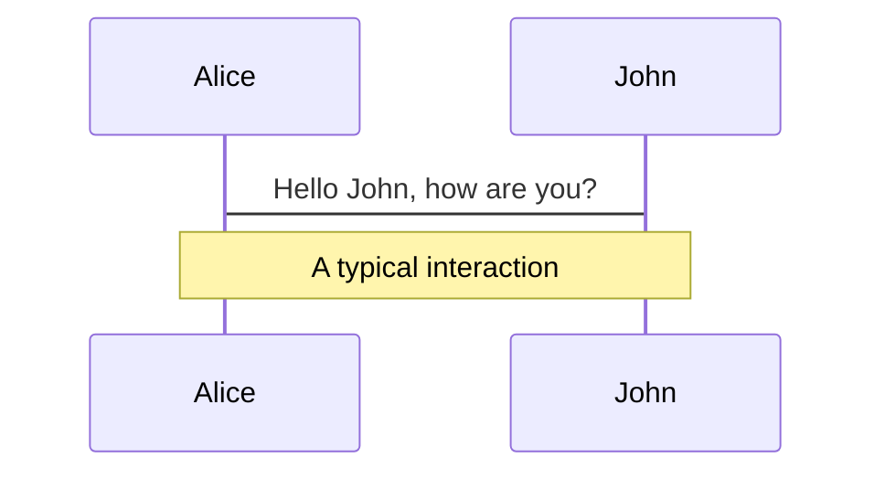
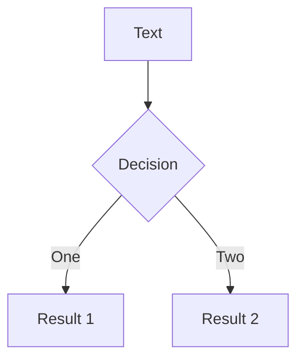
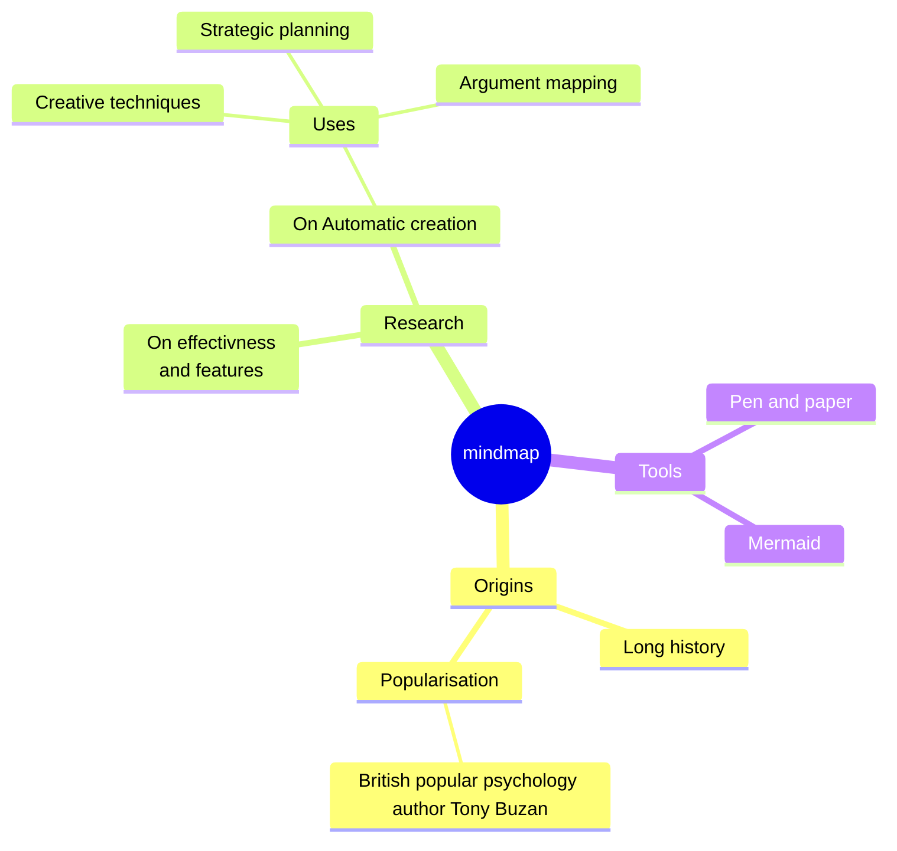
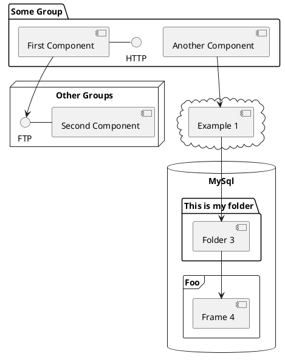

---
# 主题选择
# theme: seriph
theme: dracula
# 首页背景图片
# background: /pubilc/page1.jpg
background: https://source.unsplash.com/collection/94734566/1920x1080
# class: content-end text-left
class: text-center
highlighter: shiki
lineNumbers: false
info: |
  ## Slidev Starter Template
  Presentation slides for developers.

  Learn more at [Sli.dev](https://sli.dev)
drawings:
  persist: false
transition: slide-left
title: Welcome to Slidev
mdc: true
---

# PPT文档 演示标题

Presentation slides for developers

<div class="pt-12">
  <span @click="$slidev.nav.next" class="px-2 py-1 rounded cursor-pointer" hover="bg-white bg-opacity-10">
    请按空格键查看下一页 <carbon:arrow-right class="inline"/>
  </span>
</div>

<div class="abs-br m-6 flex gap-2">
  <button @click="$slidev.nav.openInEditor()" title="Open in Editor" class="text-xl slidev-icon-btn opacity-50 !border-none !hover:text-white">
    <carbon:edit />
  </button>
  <a href="https://github.com/slidevjs/slidev" target="_blank" alt="GitHub"
    class="text-xl slidev-icon-btn opacity-50 !border-none !hover:text-white">
    <carbon-logo-github />
  </a>
</div>

<!--
每张幻灯片的最后一个注释块将被视为幻灯片注释。它将在演示者模式下与幻灯片一起显示和编辑。 [Read more in the docs](https://sli.dev/guide/syntax.html#notes)
-->

<style>
/* .slidev-layout.slidev-page-1 {
  background-image:url("/pubilc/page1.jpg") !important;
  color: #5a5a5a !important;
} */
p{
    text-transform:uppercase;
}
</style>
<!-- 
* 最后部分的注释可以在演讲模式下只针对你个人展示出来
* 没错，是这样的
-->

---
transition: fade-out
---

# 什么是 Slidev?

Slidev是一个为开发人员设计的幻灯片制作和演示器，包括以下功能

- 📝 **Text-based** - 将重点放在Markdown的内容上，然后再对它们进行样式化
- 🎨 **Themable** - 主题可以与NPM包共享和使用
- 🧑‍💻 **Developer Friendly** - 代码高亮显示，实时编码与自动完成
- 🤹 **Interactive** - 嵌入Vue组件来增强表达式
- 🎥 **Recording** - 内置录音和相机视图
- 📤 **Portable** - 导出为PDF, png，甚至可托管的SPA
- 🛠 **Hackable** - 网页上任何可能的东西

<br>
<br>

阅读更多关于[为什么使用Slidev?](https://sli.dev/guide/why)

<!--
您可以在markdown中使用“style”标签来覆盖当前页面的样式。
Learn more: https://sli.dev/guide/syntax#embedded-styles
-->

<style>
h1 {
  background-color: #2B90B6;
  background-image: linear-gradient(45deg, #4EC5D4 10%, #146b8c 20%);
  background-size: 100%;
  -webkit-background-clip: text;
  -moz-background-clip: text;
  -webkit-text-fill-color: transparent;
  -moz-text-fill-color: transparent;
}
</style>

<!--
每一页的最后的注释或评论部分都可以在演讲模式下只针对你个人展示出来
-->

---
layout: default
transition: slide-left
---

# 目录表

Toc组件可以自动生成目录表，[了解更多](https://cn.sli.dev/builtin/components.html#toc)

```html
<Toc minDepth="1" maxDepth="1"></Toc>
```

<Toc maxDepth="1"></Toc>

---
transition: slide-up
level: 2
---

# 导航栏

将鼠标悬停在左下角以查看导航的控制面板, [learn more](https://cn.sli.dev/guide/navigation.html)

### 键盘快捷键

|     |     |
| --- | --- |
| <kbd>right</kbd> / <kbd>space</kbd>| next animation or slide |
| <kbd>left</kbd>  / <kbd>shift</kbd><kbd>space</kbd> | previous animation or slide |
| <kbd>up</kbd> | previous slide |m
| <kbd>down</kbd> | next slide |

<!-- 点击动画
 https://cn.sli.dev/guide/animations.html#click-animations -->

<p v-after class="absolute bottom-23 left-45 opacity-30 transform -rotate-10">Here!</p>

---
layout: image-right
image: https://source.unsplash.com/collection/94734566/1920x1080
---

# 代码片段

使用代码片段并直接获得高亮显示![^1]

```ts {all|2|1-6|9|all}
interface User {
  id: number
  firstName: string
  lastName: string
  role: string
}

function updateUser(id: number, update: User) {
  const user = getUser(id)
  const newUser = { ...user, ...update }
  saveUser(id, newUser)
}
```

<arrow v-click="[3, 4]" x1="400" y1="420" x2="230" y2="330" color="#564" width="3" arrowSize="1" />

[^1]: [Learn More](https://cn.sli.dev/guide/syntax.html#line-highlighting)

<style>
.footnotes-sep {
  @apply mt-20 opacity-10;
}
.footnotes {
  @apply text-sm opacity-75;
}
.footnote-backref {
  display: none;
}
</style>

---

# 组件

<div grid="~ cols-2 gap-4">
<div>

您可以直接在幻灯片中使用Vue组件。

我们提供了一些内置组件，如 `<Tweet/>` 和 `<Youtube/>` 您可以直接使用。添加自定义组件也非常容易。

```html
<Counter :count="10" />
```

<!-- ./components/Counter.vue -->
<Counter :count="10" m="t-4" />

Check out [the guides](https://cn.sli.dev/builtin/components.html) for more.

</div>
<div>

```html
<Tweet id="1390115482657726468" />
```

<Tweet id="1390115482657726468" scale="0.65" />

</div>
</div>

<!--
Presenter note with **bold**, *italic*, and ~~striked~~ text.

Also, HTML elements are valid:
<div class="flex w-full">
  <span style="flex-grow: 1;">Left content</span>
  <span>Right content</span>
</div>
-->


---
class: px-20
---

# 主题

Slidev具有强大的主题支持。主题可以为工具提供样式、布局、组件甚至配置。在主题之间切换只需**one edit**在你的frontmatter:

<div grid="~ cols-2 gap-2" m="-t-2">

```yaml
---
theme: default
---
```

```yaml
---
theme: seriph
---
```


</div>

了解 [如何使用主题](https://cn.sli.dev/themes/use.html) 和
查看 [很棒的主题图库](https://cn.sli.dev/themes/gallery.html).

---
preload: false
---

# 动画

Animations are powered by [@vueuse/motion](https://motion.vueuse.org/).

```html
<div
  v-motion
  :initial="{ x: -80 }"
  :enter="{ x: 0 }">
  Slidev
</div>
```

<div class="w-60 relative mt-6">
  <div class="relative w-40 h-40">
    
    
    
  </div>

  <div
    class="text-5xl absolute top-14 left-40 text-[#2B90B6] -z-1"
    v-motion
    :initial="{ x: -80, opacity: 0}"
    :enter="{ x: 0, opacity: 1, transition: { delay: 2000, duration: 1000 } }">
    
  </div>
</div>

<!-- Vue脚本设置脚本可以直接在markdown中使用，并且只会影响当前页面 -->
<script setup lang="ts">
const final = {
  x: 0,
  y: 0,
  rotate: 0,
  scale: 1,
  transition: {
    type: 'spring',
    damping: 10,
    stiffness: 20,
    mass: 2
  }
}
</script>

<div
  v-motion
  :initial="{ x:35, y: 40, opacity: 0}"
  :enter="{ y: 0, opacity: 1, transition: { delay: 3500 } }">

[Learn More](https://sli.dev/guide/animations.html#motion)

</div>


---

# LaTeX

LaTeX is supported out-of-box powered by [KaTeX](https://katex.org/).

<br>

Inline $\sqrt{3x-1}+(1+x)^2$

Block
$$ {1|3|all}
\begin{array}{c}

\nabla \times \vec{\mathbf{B}} -\, \frac1c\, \frac{\partial\vec{\mathbf{E}}}{\partial t} &
= \frac{4\pi}{c}\vec{\mathbf{j}}    \nabla \cdot \vec{\mathbf{E}} & = 4 \pi \rho \\

\nabla \times \vec{\mathbf{E}}\, +\, \frac1c\, \frac{\partial\vec{\mathbf{B}}}{\partial t} & = \vec{\mathbf{0}} \\

\nabla \cdot \vec{\mathbf{B}} & = 0

\end{array}
$$

<br>

[Learn more](https://sli.dev/guide/syntax#latex)

---

# 图表

您可以直接在Markdown中从文本描述创建图表/图形。

<div class="grid grid-cols-4 gap-5 pt-4 -mb-6">









</div>

[了解更多](https://cn.sli.dev/guide/syntax.html#diagrams)

---
src: ./pages/multiple-entries.md
hide: false
---

---
layout: center
class: text-center
---

# Learn More

[文档](https://cn.sli.dev) · [GitHub](https://github.com/slidevjs/slidev) · [案例展示](https://cn.sli.dev/showcases.html)

---
src: ./pages/end-page.md
---
