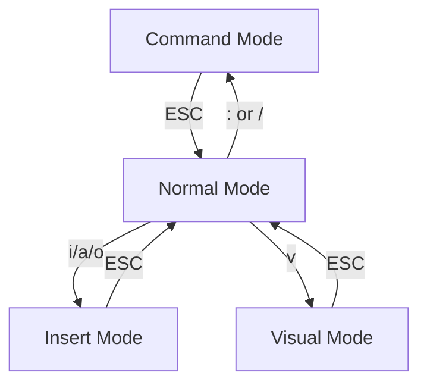

# Vim 的模式

<br>

Vim 包含多种模式，每种模式都有不同的用途，这些模式之间可以相互切换，这也是 Vim 的核心特性。Vim 的模式粗略分为以下几种：

- **Normal** 模式：用于文本编辑
- **Insert** 模式：用于文本输入
- **Visual** 模式：用于文本选择
- **Command** 模式：用于执行命令

::right::

<div class="ml-20 mt-20">

<!--  -->
  


</div>

<!--

Vim 的哲学之一是「快速编辑文本」，这是 Vim 的核心理念，也是 Vim 的设计目标。Vim 的设计者 Bram Moolenaar 一直坚持这个哲学，他认为 Vim 的设计应该是简单的且高效的。

「模式」是 Vim 中最重要的概念，Vim 为每种模式赋予了一种场景，根据不同的场景，切换到不同的模式，让我们能够专注于当前的任务，并迅速处理。有很多人说过 Vim 的编辑模式，容易让人进入「心流」的状态，想必这就是专注的魅力。

-->

---
layout: center
title: Vim 键位图
level: 2
growX: -100
---

# Vim 键位图


<!--

看似很复杂，实则一点也不简单……

-->

---
layout: center
class: text-center
hideInToc: true
growX: 50
growY: 50
growSize: 0.5
---

# 忘掉刚才那张图……

<!--

估计你也没记住……

-->

---
title: Vim 的语法
level: 1
---

# 动词 (Operator)

Operator 是 Vim 负责编辑的命令，它们是一种动作，比如：

- `d` Delete 删除
- `r` Replace 替换
- `c` Change 修改
- `y` Yank 复制
- `p` Put 粘贴


而由于行操作太常见了，所以 Vim 设计了一些快捷指令:

- `dd` 删除一行
- `yy` 复制一行
- `cc` 修改一行

<!--

很多人都尝试要学习过 Vim，但是却被 Vim 那琳琅满目的快捷键所吓退，但是我想说它的快捷键并不复杂。

-->

---
layout: two-cols
class: p-10
title: 名词
level: 2
growX: 50
growY: 130
growSize: 1.5
---

# 名词 (Text Object)

名词代表了我们即将处理的文本。Vim 中有一个专门的术语叫做文本对象（[text object](https://vimhelp.org/motion.txt.html#object-select)）：

- `w` Word 一个单词
- `s` Sentence 一个句子
- `p` Paragraph 一个段落
- `b` Bracket 括号
- `t` Tag 标签 (HTML)

::right::

<v-click>

# 介词（修饰符）

介词界定了待编辑文本的范围或者位置。例如：

- `i` inside 在...之内
- `a` around 环绕...
- `t` To 到...位置前 （不包括该字符）
- `f` Forward 到...位置上 （包括该字符）

</v-click>

---
layout: two-cols
class: p-2
title: 组词为句
level: 2
growX: 10
growY: 120
---

# 组词为句

<br>

```
动词 + 介词 + 名词
```

<br>

- `diw`: 删除当前的单词 (delete inside word)
- `dte`: 删除文本直到字符e (delete to 'e')
- `cib`: 改变当前的`()`内容 (change inside bracket)


::right::


---
src: ../../../reuse/demo-time.md
hideInToc: true
---

---
layout: two-cols
title: Vim 的语法
level: 2
growX: 10
growY: 100
---

# Vim 的语法

<br>

```
动词 + 介词 + 名词
```

<br>

```
动词 + 介词/数词 + 名词
```

<br>

```
数词 + 动词 + 名词
```

<br>

<v-click>

如果我们深入地想一下，Vim 背后蕴含了一个伟大的思想：**正交**。

</v-click>

::right::

<v-click>

<div class="ml-10 mt-20">

动词、名词、介词之间是正交的，它们不但可以独立变化，而且可以任意组合：


</div>

</v-click>

<!--

正是有各种各样内置的、定制的命令，我们可以看到那些 Vim 大神们双手在键盘中上下翻飞，屏幕上的代码如同魔术一般变换，让人叹为观止。

-->
