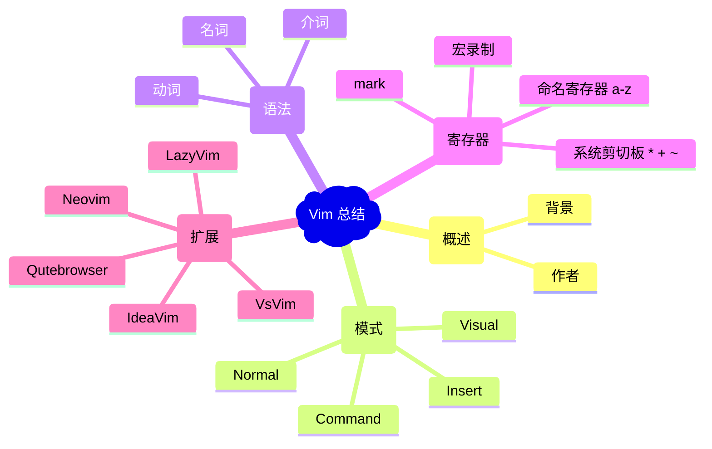

```mermaid {theme: 'dark', scale: 0.9}
mindmap
  root )Vim 总结(
    A (概述)
      背景
      作者
    B (模式)
      Normal
      Insert
      Visual
      Command
    C (语法)
      动词
      名词
      介词
    D (寄存器)
      命名寄存器 a-z
      系统剪切板 * + ~
      mark
      宏录制
    E (扩展)
      Neovim
      LazyVim
      VsVim
      IdeaVim
      Qutebrowser
```

---
layout: center
growX: 50
growY: 50
growSize: 0.4
---

# Q&A

### 问你想问

